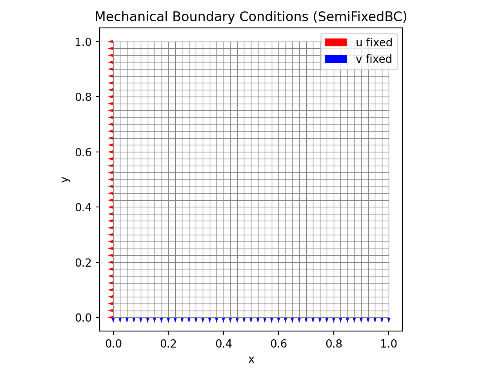
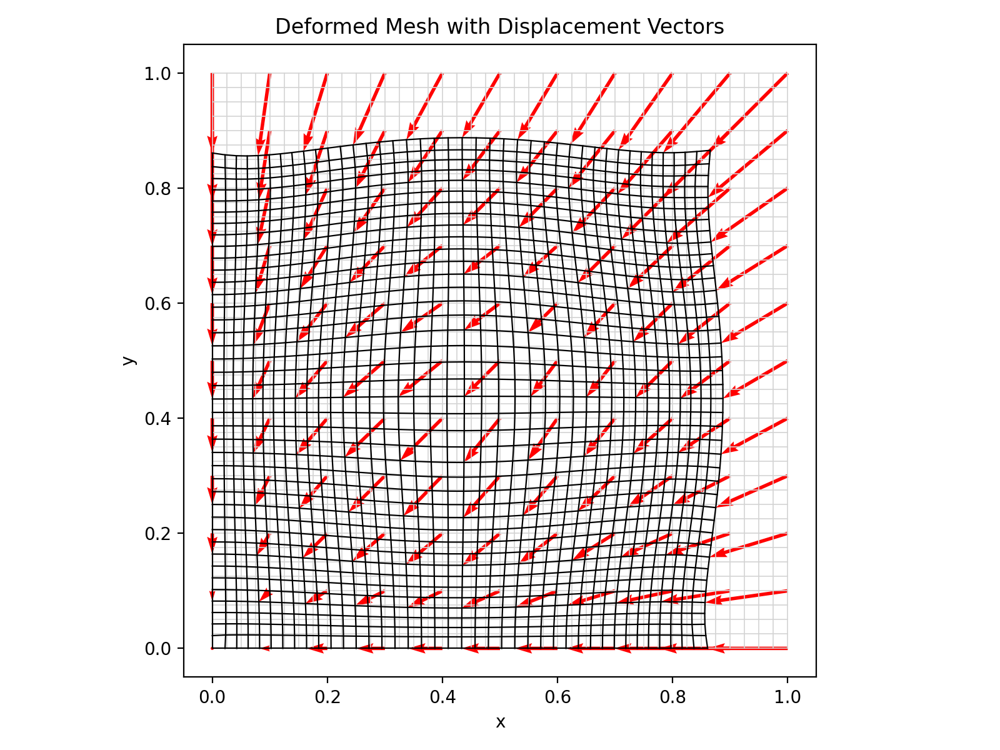
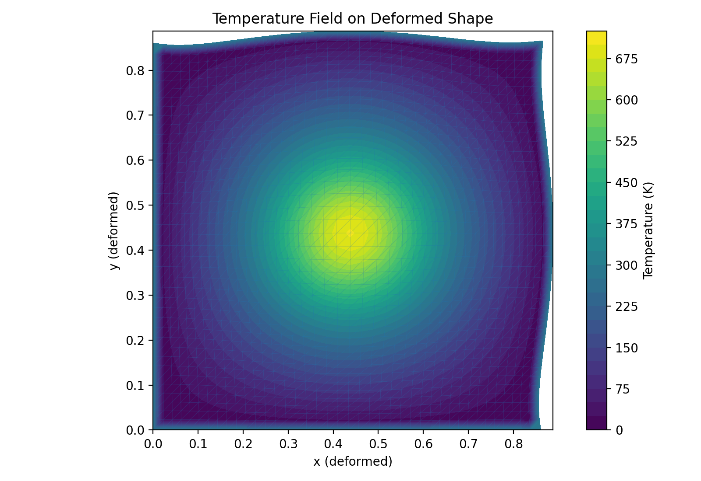
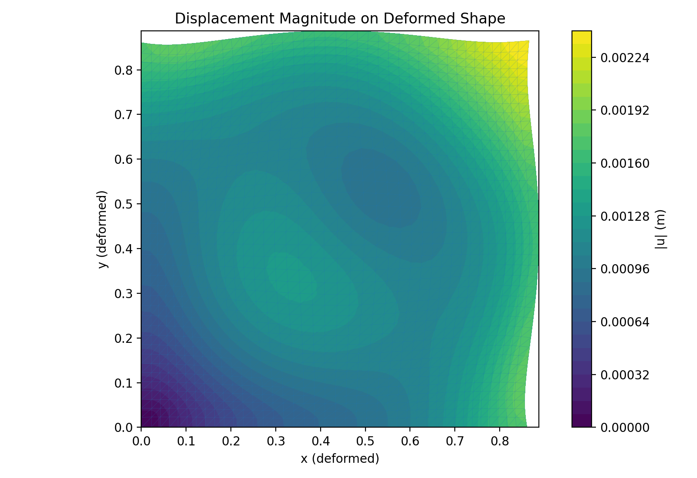
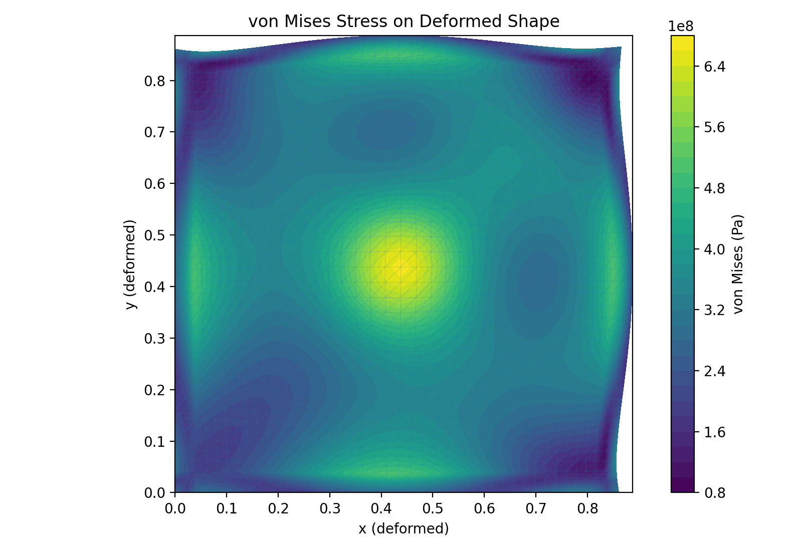

# Thermo-Mechanical Hotspot  
### Class-Based 2D Finite Element Implementation in Python

Author: **Habib Pouriayevali**

---

## Overview

This project presents a fully self-contained thermo-mechanical finite element solver implemented in Python using an object-oriented, industry-style architecture.

The model simulates:

- Steady-state heat conduction with internal Gaussian heat generation
- Thermally induced elastic deformation (plane stress)
- Stress concentration due to constrained thermal expansion
- Visualization on both undeformed and deformed configurations

The implementation emphasizes clean numerical structure, modular design, and professional FEM workflow.

---

## Physical Model

A 1 m × 1 m square domain is subjected to:

- Gaussian volumetric heat source centered in the domain
- Prescribed temperature boundary conditions
- Mechanical constraints (SemiFixedBC or AllFixedBC)
- Thermal expansion governed by linear thermoelasticity

---

## Governing Equations

### Heat Conduction

∇ · (k ∇T) + q = 0

### Thermoelasticity (Plane Stress)

σ = C (ε − ε_th)

ε_th = α (T − T_ref) [1, 1, 0]^T

### von Mises Stress

σ_vm = √(σ_xx² − σ_xxσ_yy + σ_yy² + 3σ_xy²)

---

## Numerical Implementation

### Discretization
- Q4 bilinear quadrilateral elements
- 2×2 Gauss integration
- Structured mesh generation

### Linear Algebra
- Sparse global stiffness assembly (SciPy CSR)
- Direct sparse solver (spsolve)

### Software Architecture

- `Mesh` → Structured Q4 grid
- `Material` → Plane-stress constitutive law
- `ThermalSolver` → Heat equation assembly
- `ThermoElasticSolver` → Coupled mechanical response
- `BoundaryCondition` → Strategy pattern (flexible constraints)
- `PostProcessor` → Stress and displacement evaluation
- Dedicated visualization utilities

The structure mirrors professional CAE code organization.

---

## Results

### Mechanical Boundary Conditions

Red arrows: horizontal constraint  
Blue arrows: vertical constraint  



---

### Deformed Mesh and Displacement Vectors



---

### Temperature Field on Deformed Shape



---

### Displacement Magnitude



---

### von Mises Stress



---

## Outputs

Running the script generates:

- thermal_T.png
- thermo_disp.png
- thermo_vonmises.png
- T_on_deformed.png
- U_on_deformed.png
- VM_on_deformed.png

---

## Dependencies

- numpy
- scipy
- matplotlib

Install with:

```bash
pip install numpy scipy matplotlib
